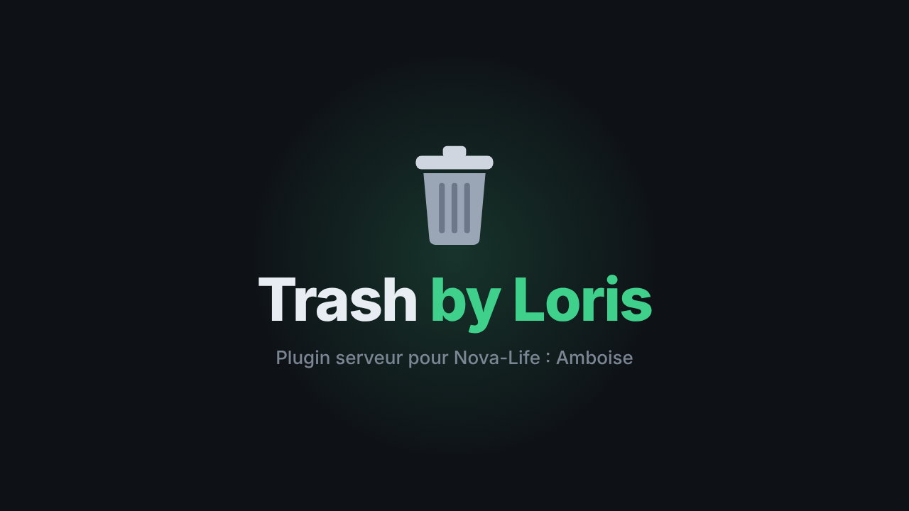

<p align="center">
  
</p>

<p align="center">
  <b>Des poubelles sur ta map : les joueurs y jettent leurs objets, et ils disparaissent pour de bon.</b><br>
  Plugin serveur pour <b>Nova-Life : Amboise</b>
</p>

<p align="center">
  
  
  
  
</p>

---

## 🎬 Aperçu

<p align="center">
  
</p>

▶️ Vidéo de présentation complète (avec musique) : [`media/presentation.mp4`](media/presentation.mp4)

---

## 🗑️ Présentation

**Trash by Loris** permet aux admins de placer des **poubelles** (points bleus) n'importe où sur la map.

Un joueur qui veut se débarrasser d'un objet va à une poubelle, choisit l'objet et la quantité, et c'est fini :

- l'objet est **retiré de son inventaire** ;
- il n'est **stocké nulle part** (ni coffre ni stockage caché) ;
- **personne ne peut le récupérer**, pas même un admin.

Fini les objets jetés par terre partout sur la map : les joueurs ont un endroit propre pour vider leur inventaire.

## ✨ Fonctionnalités

| | |
|---|---|
| 📍 **Poubelles placées par les admins** | Autant de poubelles que tu veux, où tu veux. |
| 🏷️ **Modèles nommés** | « Poubelle de la mairie », « Poubelle du port »… Le nom s'affiche aux joueurs. |
| 🎒 **Menu inventaire** | Le joueur voit son inventaire avec les icônes et les quantités. |
| 🔢 **Quantité au choix** | Jeter une partie de ses objets, ou **Tout jeter** d'un coup. |
| ⚠️ **Avertissement** | Le joueur est prévenu que l'objet sera détruit avant de valider. |
| 🔥 **Destruction définitive** | Les objets jetés sont effacés, impossible de les récupérer. |
| 🛠️ **Gestion complète** | Renommer, déplacer, se téléporter ou supprimer une poubelle. |
| 💾 **Sauvegarde** | Les poubelles restent en place après un redémarrage du serveur. |
| 🔒 **Réservé au staff** | Seuls les admins en service peuvent gérer les poubelles. |

## 📦 Installation

1. Vérifie que **ModKit** et **AAMenu** sont installés sur ton serveur.
2. Copie **`TrashByLoris.dll`** dans le dossier **`Plugins`** du serveur.
3. Redémarre le serveur.

C'est tout, il n'y a pas de fichier de configuration à remplir.

## 🛠️ Utilisation (admins)

Passe en **service admin**, puis ouvre le menu des poubelles avec :

- la commande **`/trash`** (ou **`/poubelle`**),
- ou **AAMenu → Administration → Points bleus → Poubelle (Trash by Loris)**.

### Placer ta première poubelle

1. **Nouveau modèle** → donne un nom (ex. `Poubelle de la mairie`) → **Créer**.
2. Place-toi à l'endroit voulu.
3. Choisis ton modèle dans la liste → **Placer ici**.
4. Un point bleu apparaît à tes pieds : la poubelle est prête ✅

Tu peux placer le même modèle plusieurs fois, à plusieurs endroits.

### Gérer les poubelles

| Bouton | Action |
|---|---|
| **Modèles** | Renommer un modèle, ou le supprimer (avec toutes ses poubelles). |
| **Points** | Liste de toutes les poubelles placées : **Se téléporter**, **Déplacer ici**, **Supprimer**. |

## 🎮 Utilisation (joueurs)

1. Marche dans le **point bleu** d'une poubelle.
2. Choisis l'objet à jeter dans ton inventaire → **Jeter**.
3. Indique la quantité → **Jeter** (ou **Tout jeter**).
4. L'objet est détruit. ⚠️ **Il ne pourra pas être récupéré.**

## ❓ FAQ

**Un admin peut-il récupérer un objet jeté par erreur ?**
Non. Le plugin ne garde aucune trace des objets jetés : ils sont supprimés directement.

**Où sont enregistrées les poubelles ?**
Dans la base de données de ModKit (`Plugins/ModKit/data.sqlite`).

**Je ne vois pas les poubelles après les avoir placées.**
Les points bleus sont envoyés aux joueurs quand leur personnage apparaît. Reconnecte-toi si besoin.

**La commande `/trash` me dit « Vous devez être staff et en service admin ».**
Il faut être admin **et** avoir activé le service admin.

**Peut-il tourner en même temps que le plugin `Poubelle` ?**
Oui, ils utilisent des noms de table et des commandes différents.

## 🧑‍💻 Compiler soi-même

1. Copie les 7 DLL listées dans [`libs/README.md`](libs/README.md) dans `TrashByLoris/libs/`.
2. Ouvre **`TrashByLoris.csproj`** dans Visual Studio, ou lance :
   ```bash
   dotnet build -c Release
   ```
3. La DLL se trouve dans `bin/Release/net472/TrashByLoris.dll`.

Projet SDK-style · `net472` · C# 11.

---

<p align="center">
  Fait avec 💚 par <b>Loris</b>
</p>
